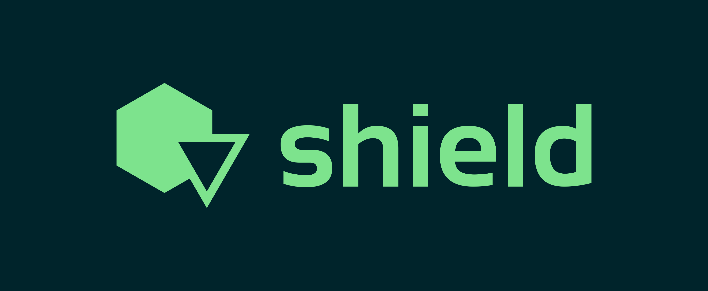

<div style="text-align: center;">
    
</div>

## Overview

⚠ This should not be in a production application. This is mostly for learning purposes.

Shield is a Python-based anti-tamper system designed to detect and respond to various malicious processes and tools that
might be used to tamper with or debug an application. It employs multiple detection mechanisms, including process name
checking, MD5 hash verification, and signature checking, to ensure the integrity of the protected process.

## Features

- **Known Malicious Process Detection**: Identifies and responds to known malicious processes by their names.
- **MD5 Hash Verification**: Checks the MD5 hash of processes against a list of known malicious hashes.
- **Digital Signature Verification**: Verifies if a process is digitally signed.
- **Concurrent Process Checking**: Uses multiprocessing and concurrent futures for efficient process checking.
- **Modular Detection Functions**: Integrates specialized detection modules for tools like Cheat Engine, IDA, and
  x64dbg.

## Modules

- `cheat_engine`: Module for detecting Cheat Engine.
- `ida`: Module for detecting IDA Pro.
- `x64dbg`: Module for detecting x64dbg.

## Usage

1. Update the list of known MD5 hashes in `hash_list.txt`.
2. Run the main script with the name of the process you want to protect.
   ```bash
   python main.py protected.exe
   ```

## Configuration

- **Known Process Names**: Modify the `known_processes` list to include additional malicious process names if needed.
- **MD5 Hash List**: Add known malicious MD5 hashes to the `hash_list.txt` file.
- **Protected Process**: Set the `protected_process_name` variable to the name of the process you want to protect.

## Detection Modules

- **Cheat Engine**: `modules.cheat_engine`
- **IDA Pro**: `modules.ida`
- **x64dbg**: `modules.x64dbg`

## Contributing

Contributions are welcome! Please submit pull requests or open issues to discuss improvements or bug fixes.

## License

This project is licensed under the MIT License. See the `LICENSE` file for more details.

---

Feel free to reach out with any questions or suggestions regarding the project!